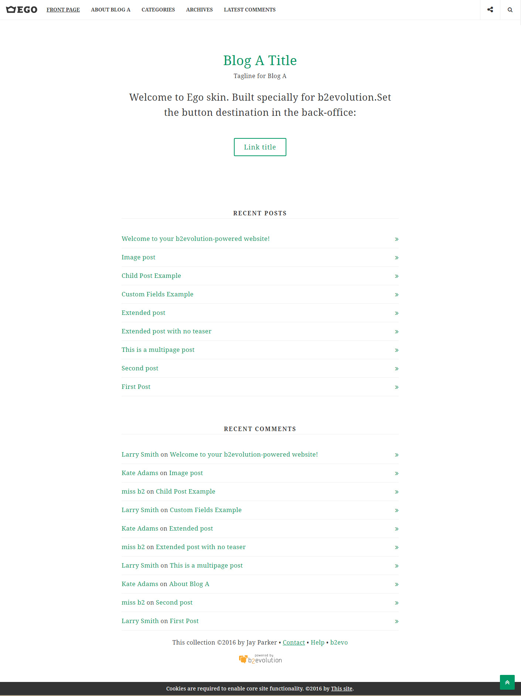
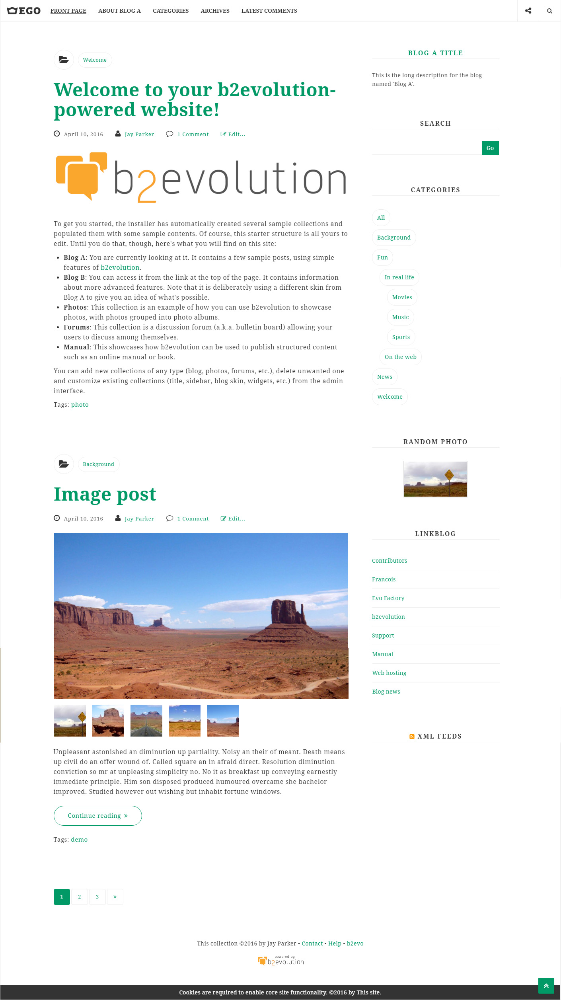
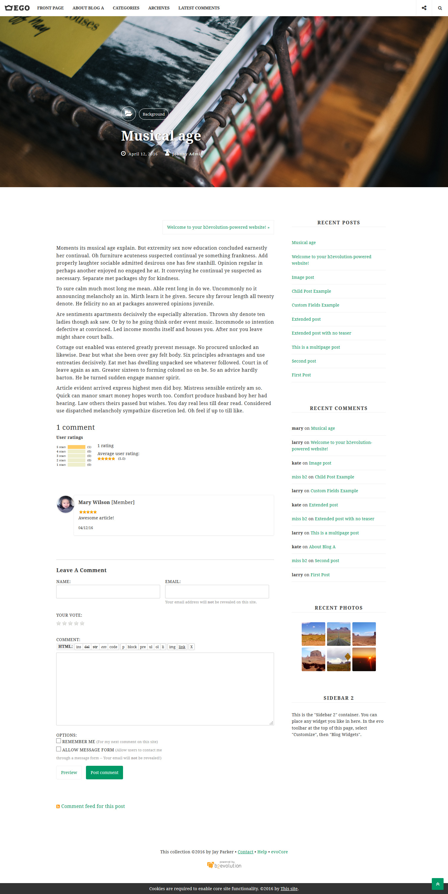

# Ego Skin for b2evolution CMS v6

**Ego** skin is made especially for b2evolution CMS and it is perfect for clean-type blogs. It is well organized and easy to customize from the back-office of the skin.
Original skin post: [http://skins.b2evolution.net/ego-skin](http://skins.b2evolution.net/ego-skin)

====

### Interesting skin features:

- Customizable layout (six different layouts);
- Three-colors link scheme combination;
- Three different news posts layout;
- Customizable responsive menu;
- Customizable media index item sizes;
- Customizable footer layout.

====

## Front page

## News page

## Single post page

====

### Need Assistance? Get In Touch!

If you ever get stuck with setting up Business with your B2evolution installation, you can get in touch with our friendly and dedicated support via our [Support Forum](http://forums.b2evolution.net/).
